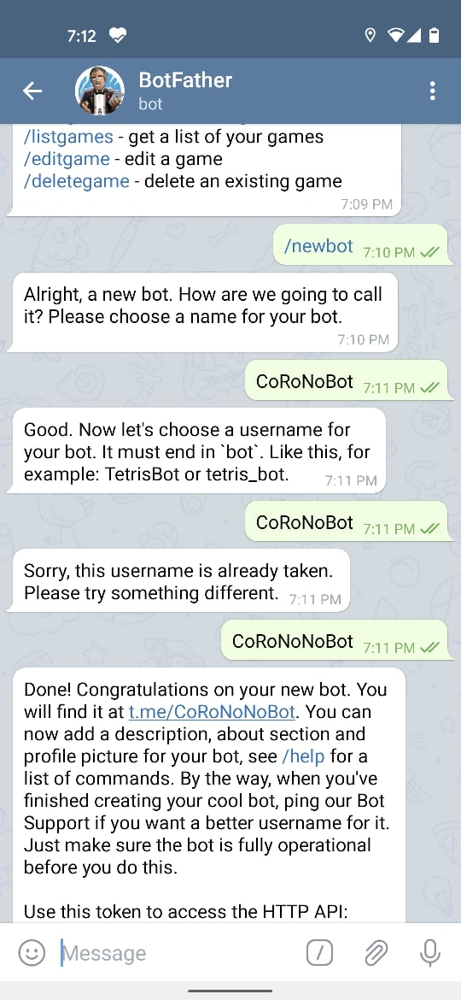

**CowinNotifier**  
A very small tiny project to try out cowin and telegram APIs.

**Build**  
mvn clean install

**Usage**

Configure a Telegram Bot
1. Search for BotFather  
2. Create a /newBot  and give any name and user-name
3. Save the token. This is needed.
4. Now Search for the newly created Bot and send a message (Anything !).

  

Execute the following Command to Run the Application:

```console
java -jar CowinNotifier-1.0-SNAPSHOT-spring-boot.jar -s <state_name> -d <district_name> -a <age> -t <token>
```   
Example
```console
java -jar CowinNotifier-1.0-SNAPSHOT-spring-boot.jar -s "Karnataka" -d "Dakshina Kannada" -a "18" -t "DoYouThinkIWillShareByBotToken"
```